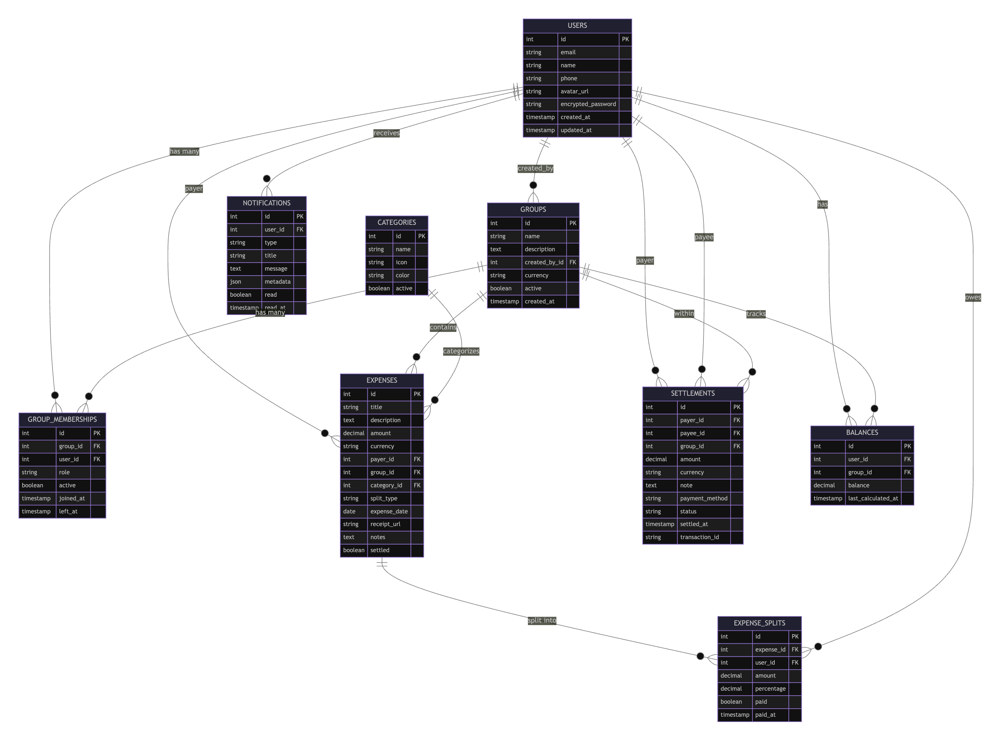

# EzSplit Rails

EzSplit is a Ruby on Rails application designed to help users manage and split expenses within groups. It provides a JSON API for creating groups, adding members, and tracking shared expenses.

## Features

This project is currently under development. Here is a list of current and planned features:

### Core Features

- ✅ User authentication
- ✅ Create, Read, Update, Delete (CRUD) for Groups
- ✅ Add/Remove users from groups
- ✅ API responses with JSON:API standard
- ✅ Pagination for lists

### Planned Features

As outlined in [Issue #1](https://github.com/t-rex777/ezsplit_rails/issues/1):

- ⏳ Add multiple users in a group
- ⏳ Add multiple groups for a user
- ⏳ Add expense tracking
- ⏳ Add expense splitting functionality
- ⏳ Track balances between users
- ⏳ Settle up balances

## Database Schema



## Tech Stack

- **Backend:** Ruby on Rails 8
- **Database:** SQLite3
- **API:** JSON:API with `jsonapi-serializer`
- **Testing:** RSpec, FactoryBot
- **Pagination:** Pagy
- **Web Server:** Puma

## Getting Started

To get a local copy up and running, follow these simple steps.

### Prerequisites

- Ruby (version specified in `.ruby-version`)
- Bundler

### Installation

1. **Clone the repo**

   ```sh
   git clone https://github.com/t-rex777/ezsplit_rails.git
   cd ezsplit_rails/store
   ```

2. **Install gems**

   ```sh
   bundle install
   ```

3. **Setup the database**

   ```sh
   rails db:create
   rails db:migrate
   rails db:seed # Optional: to seed initial data
   ```

4. **Run the server**

   ```sh
   rails server
   ```

The application will be running at `http://localhost:3000`.

## Running Tests

To run the test suite, use the following command:

```sh
bundle exec rspec
```

## Contributing

Contributions are what make the open-source community such an amazing place to learn, inspire, and create. Any contributions you make are **greatly appreciated**.

If you have a suggestion that would make this better, please fork the repo and create a pull request. You can also simply open an issue with the tag "enhancement".

1. Fork the Project
2. Create your Feature Branch (`git checkout -b feature/AmazingFeature`)
3. Commit your Changes (`git commit -m 'Add some AmazingFeature'`)
4. Push to the Branch (`git push origin feature/AmazingFeature`)
5. Open a Pull Request
