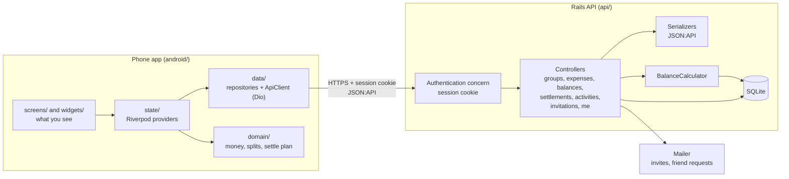
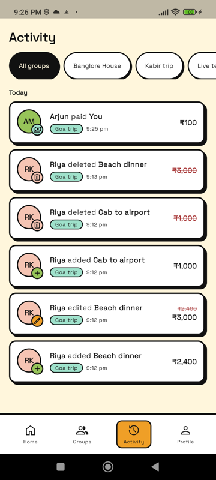
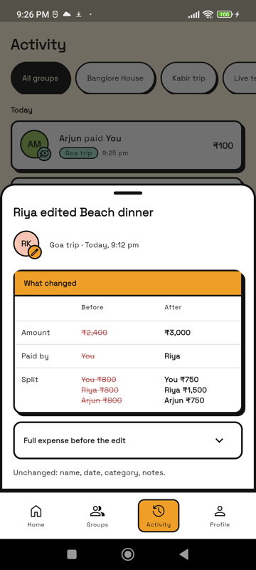
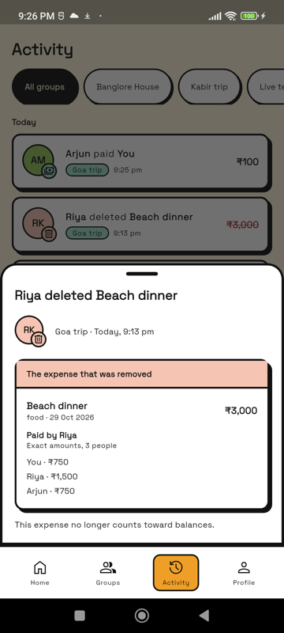
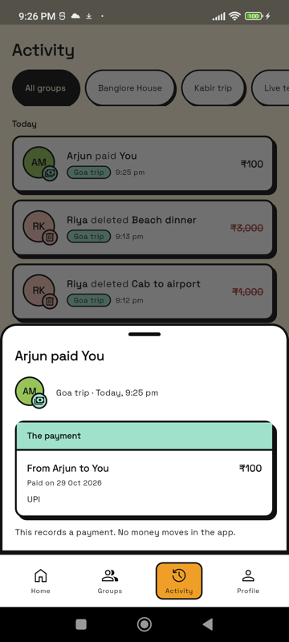

# ezsplit

ezsplit splits shared expenses between friends. Add a group, log what you paid, and the app tells everyone who owes whom.

This repo holds two packages:

| Folder | What it is | Stack |
|---|---|---|
| [`api/`](api) | The JSON API and database | Rails 8, SQLite, RSpec |
| [`android/`](android) | The phone app | Flutter 3.47, Riverpod, Dio |

## Architecture


```mermaid
flowchart LR
  subgraph Phone["Phone app (android/)"]
    UI["screens/ and widgets/<br/>what you see"]
    State["state/<br/>Riverpod providers"]
    Data["data/<br/>repositories + ApiClient (Dio)"]
    Domain["domain/<br/>money, splits, settle plan"]
    UI --> State --> Data
    State --> Domain
  end

  subgraph Server["Rails API (api/)"]
    Auth["Authentication concern<br/>session cookie"]
    Ctrl["Controllers<br/>groups, expenses, balances,<br/>settlements, activities,<br/>invitations, me"]
    Ser["Serializers<br/>JSON:API"]
    Calc["BalanceCalculator"]
    DB[("SQLite")]
    Auth --> Ctrl --> Ser
    Ctrl --> Calc --> DB
    Ctrl --> DB
  end

  Mail["Mailer<br/>invites, friend requests"]
  Data -- "HTTPS + session cookie<br/>JSON:API" --> Auth
  Ctrl --> Mail
```

How a request flows:

1. A screen reads a Riverpod provider in `android/lib/state/`.
2. The provider calls a repository in `android/lib/data/`. The repository sends the request through `ApiClient`, which keeps the session cookie.
3. Rails checks the cookie in `api/app/controllers/concerns/authentication.rb`. Then the controller loads only the data the signed-in user may see.
4. A serializer returns JSON:API. The app parses it into models in `android/lib/data/models.dart`.

Rules the API enforces:

- A group can only contain friends of the person adding them.
- Phone and date of birth are only sent to their owner.
- Inviting an existing user sends a friend request. They must accept before they become a friend.

## How it works

Screenshots from an Android phone.

| Home | Groups | A group |
|---|---|---|
|  |  |  |

| Add an expense | Balances | Profile |
|---|---|---|
|  |  |  |

| Activity | An edit | A delete | A settle-up |
|---|---|---|---|
|  |  |  |  |

1. **Home** shows your share this month, what you owe, what you are owed, and spending by category.
2. **Groups** lists your groups. Filter to groups that owe you or that you owe, and see friend requests waiting for you.
3. **A group** shows its expenses by date, with what you lent or owe on each.
4. **Add an expense.** Split it equally, by percentage, or by exact amounts. The app shows each share before you save.
5. **Balances** shows who owes whom and the fewest payments that settle the group. Tap **Settle up** to record one.
6. **Profile** holds your details, your categories, the light or dark theme, and log out. You stay signed in after a restart until you log out.
7. **Activity** lists who added, edited, or deleted an expense, and who settled up, with the group and the time. Filter by group, or by expenses outside any group.
8. **An edit** shows each changed field before and after, and the full expense as it was.
9. **A delete** shows the expense that was removed, so it stays readable.
10. **A settle-up** shows who paid whom, how much, and when.

## Run it locally

Start the API on port 3100:

```bash
cd api
mise exec ruby@3.2.2 -- bin/rails db:prepare
mise exec ruby@3.2.2 -- bin/rails server -p 3100
```

Run the app on a plugged-in Android phone:

```bash
adb reverse tcp:3100 tcp:3100
```

```bash
cd android && flutter run
```

The app calls `http://localhost:3100` by default. Change it with `--dart-define=API_BASE_URL=...`. Release builds refuse any address that is not `https`.

### Run the API in Docker with ngrok

The API can run as the production image and be reached from anywhere through a static ngrok tunnel.

1. Fill in `api/.env`:
   - `SECRET_KEY_BASE`: output of `openssl rand -hex 64`
   - `NGROK_AUTHTOKEN`: from the ngrok dashboard
   - `NGROK_DOMAIN`: your static domain, e.g. `ezsplit.ngrok-free.dev`
   - `APP_HOST`: the same domain
2. Start the stack:

   ```bash
   cd api
   docker compose up --build -d
   ```

3. Check it:

   ```bash
   curl -fsS https://<your-static-domain>/up
   docker compose logs -f ngrok
   ```

   The ngrok dashboard is at `http://localhost:4040`.

4. Point the phone app at the tunnel:

   ```bash
   cd android
   flutter run --dart-define=API_BASE_URL=https://<your-static-domain>
   ```

   Release builds accept HTTPS addresses only, so the ngrok URL works.

The API stores SQLite in the `api_storage` Docker volume. The `backup` container writes a consistent copy to `api/backups/` once a day and keeps 14 days.

#### Off-site backup to Cloudflare R2

Litestream continuously replicates the SQLite files to R2 and restores them automatically if the Docker volume is empty.

1. In the Cloudflare dashboard, open **R2** and create a bucket named `ezsplit-backups`.
2. Create an R2 API token with **Object Read & Write**, scoped to that bucket.
3. Fill these values in `api/.env`:

   ```env
   BUCKET_NAME=ezsplit-backups
   AWS_ENDPOINT_URL_S3=https://<ACCOUNT_ID>.r2.cloudflarestorage.com
   AWS_ACCESS_KEY_ID=<token access key>
   AWS_SECRET_ACCESS_KEY=<token secret>
   AWS_REGION=auto
   ```

4. Recreate the API container and check the logs:

   ```bash
   docker compose up -d --force-recreate api
   docker compose logs -f api
   ```

   Look for Litestream opening the replica. Backups appear under `storage/` in the bucket.

To test a restore, remove the volume and start again; Litestream restores the latest snapshot before Rails boots:

```bash
docker compose down
docker volume rm ezsplit_api_storage
docker compose up -d
```

Only do that when you are sure the R2 copy is current.

### Test on phones over Wi-Fi

Run the API on your Mac so other devices on the same Wi-Fi can reach it. Find the Mac's address with `ipconfig getifaddr en0`; the examples use `192.168.1.4`.

```bash
cd api && APP_HOST=192.168.1.4 APP_PORT=3100 mise exec ruby@3.2.2 -- bin/rails server -p 3100 -b 0.0.0.0
```

`APP_HOST` and `APP_PORT` set the address used in invite emails. Then build a LAN APK, which may use `http` to a private address only:

```bash
cd android && EZSPLIT_LAN_HTTP=1 flutter build apk --release --dart-define=API_BASE_URL=http://192.168.1.4:3100 --dart-define=ALLOW_LAN_HTTP=true
```

The session cookie travels unencrypted over the Wi-Fi in this build, so use it only on a network you trust. If the Mac's address changes, rebuild. Normal release builds stay https-only.

## Tests

```bash
cd api && mise exec ruby@3.2.2 -- bundle exec rspec
```

```bash
cd android && flutter test
```

## Branching and deployment

- `main` is the integration branch. Merge feature work into `main` through PRs.
- `production` is protected. Direct pushes are blocked; open a PR from `main` to `production`.
- Merging into `production` runs `.github/workflows/deploy-production.yml` on the self-hosted macOS runner. It pulls the latest `production`, rebuilds the Docker image, restarts the stack, and checks `/up`.
- The self-hosted runner must be online on the Mac that hosts Docker.
- A PR into `production` from anything other than `main` fails the `Production PR guard` check.
- Fly.io automatic deploys are disabled. Run the **Fly Deploy (manual)** workflow if you intentionally want to deploy to Fly.

## Releases

Every push to `production` that changes `android/` builds a signed APK. The workflow `.github/workflows/android-apk.yml` attaches it to a GitHub pre-release named `production-<run number>`.

To install it: open the repo's **Releases** page on your phone, download the newest `ezsplit-production-*.apk`, and open it. Each build has a higher build number, so it installs over the last one.

### One-time setup

The workflow needs one repository variable and four secrets. Without them the build stops with an error that names the missing one.

1. Make a signing key. Keep the file and passwords somewhere safe; losing them means users must uninstall to update.

   ```bash
   keytool -genkeypair -keystore ezsplit-release.jks -alias ezsplit -keyalg RSA -keysize 2048 -validity 10000
   ```

2. In GitHub, open **Settings → Secrets and variables → Actions** and add:

   | Name | Kind | Value |
   |---|---|---|
   | `API_BASE_URL` | Variable | The live API address, starting with `https://` |
   | `ANDROID_KEYSTORE_BASE64` | Secret | Output of `base64 -i ezsplit-release.jks` |
   | `ANDROID_KEYSTORE_PASSWORD` | Secret | The keystore password |
   | `ANDROID_KEY_ALIAS` | Secret | `ezsplit` |
   | `ANDROID_KEY_PASSWORD` | Secret | The key password |

The API workflows (RSpec, Rubocop, Brakeman) run only when `api/` changes.
